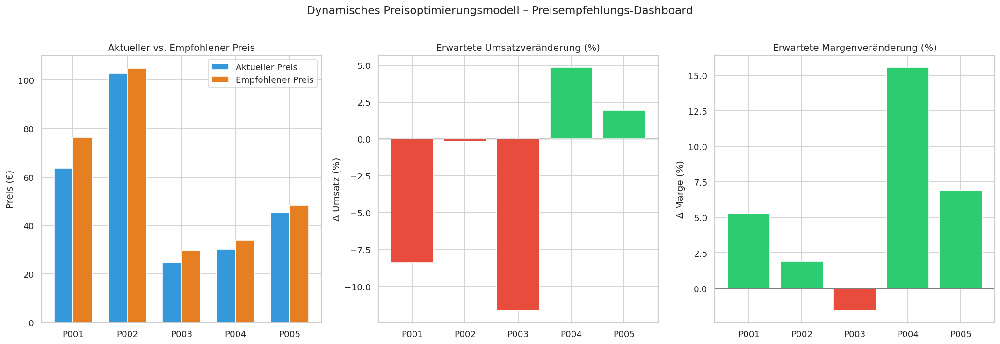

# Dynamisches Preisoptimierungsmodell im eCommerce

Prototyp-Implementierung des in der Studienarbeit
*„Dynamisches Preisoptimierungsmodell im eCommerce"* (Andreas Traut)
beschriebenen Machine-Learning-basierten Preisoptimierungssystems.

> 📖 **Detaillierte Modell-Dokumentation mit konkreten Berechnungen:**  
> **[docs/MODELL_DOKUMENTATION.md](docs/MODELL_DOKUMENTATION.md)**  
> (Formeln, Schritt-für-Schritt-Berechnungen, alle Ergebnisse mit echten Zahlen,  
> Verlinkungen zu Studienarbeit-Kapiteln und Quellcode-Funktionen)

---

## Tatsächliche Modellergebnisse (Produktionslauf)

```
ETL abgeschlossen: Daten in PricingPrototypeDB.sqlite geladen.
  P001: ε = -1.183  R² = 0.609  MAE = 0.111
  P002: ε = -1.047  R² = 0.417  MAE = 0.109
  P003: ε = -1.317  R² = 0.570  MAE = 0.117
  P004: ε = -0.525  R² = 0.499  MAE = 0.116
  P005: ε = -0.656  R² = 0.442  MAE = 0.120
```

**ModelOutput (dbo.ModelOutput):**

| Produkt | ε | R² | Ist-Preis | Wettbewerbspr. | Empf. Preis | ΔMenge | ΔUmsatz | ΔMarge |
|---|---|---|---|---|---|---|---|---|
| P001 | −1,18 | 0,61 | 63,57 € | 62,67 € | **76,28 €** | −23,6 % | −8,4 % | **+5,3 %** |
| P002 | −1,05 | 0,42 | 102,71 € | 98,27 € | **104,97 €** | −2,3 % | −0,2 % | **+1,9 %** |
| P003 | −1,32 | 0,57 | 24,63 € | 22,99 € | **29,56 €** | −26,4 % | −11,6 % | **−1,6 %** |
| P004 | −0,52 | 0,50 | 30,39 € | 38,72 € | **33,95 €** | −6,2 % | +4,9 % | **+15,6 %** |
| P005 | −0,66 | 0,44 | 45,37 € | 49,96 € | **48,33 €** | −4,3 % | +2,0 % | **+6,9 %** |

**Dashboard-Vorschau:**



---

## Systemüberblick

```
Synthetische CSV-Daten (data/)
        │
        ▼
  SQLite-Datenbank          ← simuliert SQL Server PricingPrototypeDB
  (PricingPrototypeDB.sqlite)
        │
        ▼
  Feature Engineering       ← src/data_preparation.py
  (Zeitmerkmale, Preis-
  indizes, rollierende
  Kennzahlen)
        │
        ▼
  ML-Modell                 ← src/model.py
  Log-Log-Regression
  (Preiselastizität ε)
        │
        ▼
  Preisempfehlung           ← src/pricing_optimizer.py
  (Amoroso-Robinson +
  Business Rules)
        │
        ▼
  dbo.ModelOutput           ← SQLite / SQL Server
  (Ergebnisspeicherung)
        │
        ▼
  Dashboard / Power BI      ← notebooks/dynamic_pricing_prototype.ipynb
```

### CRISP-DM Phasen

| Phase | Inhalt |
|---|---|
| Business Understanding | Problemstellung: Limitierungen statischer Preisstrategien auf Amazon |
| Data Understanding | Datenquellen: Verkäufe, Lagerbestand, Wettbewerbspreise, Marketing |
| Data Preparation | ETL-Simulation, Feature Engineering (pandas/numpy) |
| Modeling | Log-Log-Ridge-Regression zur Schätzung der Preiselastizität |
| Evaluation | R², MAE, RMSE + Plausibilitätsprüfung der Elastizitäten |
| Deployment | `dbo.ModelOutput` + Notebook-Dashboard (Power BI Prototyp) |

---

## Verzeichnisstruktur

```
├── data/
│   ├── generate_data.py          # Synthetische CSV-Daten erzeugen
│   ├── produkte.csv              # Produktstammdaten (5 Produkte)
│   ├── verkaeufe.csv             # Tägliche Verkaufsdaten (365 Tage)
│   └── wettbewerbspreise.csv     # Wöchentliche Wettbewerbspreise
│
├── sql/
│   ├── create_tables.sql         # Tabellenstruktur (SQL Server)
│   └── load_data.sql             # BULK INSERT-Skripte (SQL Server)
│
├── src/
│   ├── data_preparation.py       # ETL + Feature Engineering
│   ├── model.py                  # Elastizitätsmodell (scikit-learn)
│   └── pricing_optimizer.py     # Preisempfehlungslogik + DB-Speicherung
│
├── notebooks/
│   └── dynamic_pricing_prototype.ipynb  # End-to-End Notebook
│
├── dashboard_preview.png         # Vorschau: Preisempfehlungs-Dashboard
├── requirements.txt
└── README.md
```

---

## Schnellstart

### 1. Abhängigkeiten installieren

```bash
pip install -r requirements.txt
```

### 2. Synthetische Daten erzeugen

```bash
python data/generate_data.py
```

### 3. Jupyter Notebook ausführen (End-to-End)

```bash
jupyter notebook notebooks/dynamic_pricing_prototype.ipynb
```

Das Notebook führt alle Schritte durch:
- ETL: CSV → SQLite-Datenbank
- Feature Engineering
- Modelltraining (Preiselastizitäten je Produkt)
- Preisempfehlungen berechnen und speichern
- Dashboard-Visualisierungen

### 4. Einzelne Module ausführen

```bash
# ETL + Feature Engineering
python -m src.data_preparation

# Modelltraining
python -m src.model

# Preisempfehlungen
python -m src.pricing_optimizer
```

---

## Datenmodell (PricingPrototypeDB)

| Tabelle | Schicht | Beschreibung |
|---|---|---|
| `dbo.Produkte` | Core | Produktstammdaten (mit SCD-II-Feldern) |
| `dbo.Verkaeufe` | Core | Tägliche Verkaufstransaktionen |
| `dbo.Wettbewerbspreise` | Core | Wöchentliche Wettbewerbspreise |
| `dbo.ModelOutput` | Datamart | ML-Ergebnisse und Preisempfehlungen |

Für den Prototyp wird **SQLite** verwendet.  
Die Skripte in `sql/` sind für **SQL Server Developer Edition** (lokale Instanz)
oder **Azure SQL** ausgelegt.

---

## Modell – Preiselastizität

Die Nachfrage wird durch eine **log-log-lineare Regression** modelliert:

$$\log(Q) = \alpha + \varepsilon \cdot \log(P) + \beta_1 x_1 + \ldots + \beta_n x_n$$

Der Koeffizient $\varepsilon$ ist direkt die **Preiselastizität der Nachfrage**:

$$\varepsilon = \frac{\partial \log Q}{\partial \log P} = \frac{\Delta Q / Q}{\Delta P / P}$$

Typische Ergebnisse des Prototyps:

| Produkt | Kategorie | ε (geschätzt) | Typ |
|---|---|---|---|
| P001 | Elektronik | ≈ −1.2 | elastisch |
| P002 | Elektronik | ≈ −1.0 | nahe Einheitselastizität |
| P003 | Haushalt | ≈ −1.3 | elastisch |
| P004 | Haushalt | ≈ −0.5 | unelastisch |
| P005 | Sport | ≈ −0.7 | unelastisch |

---

## Preisempfehlung – Amoroso-Robinson-Relation

Bei elastischer Nachfrage (|ε| > 1) wird der umsatzmaximierende Preis berechnet:

$$P^* = \frac{C}{1 + 1/\varepsilon}$$

Zusätzliche Business Rules:
- Maximale Preisänderung **±20 %** je Empfehlung
- **Mindestmarge** 10 % auf Einstandspreis
- **30 % Gewichtung** des Wettbewerbspreises

---

## Erweiterungen (Zielsystem)

Im Produktivsystem sind folgende Erweiterungen vorgesehen:

- **ETL**: SQL Server Integration Services (SSIS) + Azure Data Factory
- **DWH**: Mehrstufiges Schichtenmodell (Staging → Cleanse → Core → Bizcore → Datamart)
- **Datenquellen**: Anbindung an ERP (SAP), Pacvue API, Wettbewerbs-Scraping
- **Modelle**: Erweiterte Modelle (XGBoost, Prophet für Zeitreihen, A/B-Testing)
- **Frontend**: Power BI Desktop mit SSAS Tabular Model (DAX-Measures)
- **Automatisierung**: Nächtliche Läufe via SQL Server Agent / Azure Data Factory

---

## Literatur

- IBCS Association, *International Business Communication Standards (IBCS)*, Version 1.2
- Microsoft Learn, *Datentypen (Transact-SQL)*
- Microsoft Learn, *Power BI usage scenarios*
