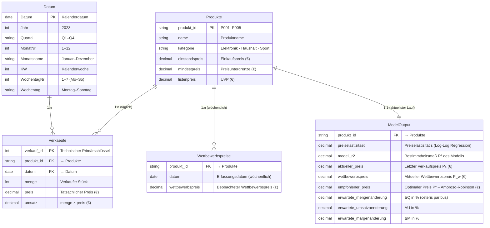

English Version of this File: [DATENMODELL_EN.md](DATENMODELL_EN.md)

# Datenmodell – PricingPrototypeDB

> **Referenz:** *Studienarbeit „Dynamisches Preisoptimierungsmodell im eCommerce" – Andreas Traut*  
> Dieses Dokument beschreibt das semantische Datenmodell des Power BI PBIP-Projekts  
> ([`powerbi/`](../powerbi/)) und die zugrundeliegende Datenbankstruktur.

---

## Star-Schema (Fakten & Dimensionen)

Das Modell folgt einem **Star-Schema** mit einer zentralen Faktentabelle (`Verkaeufe`),  
einer Datamart-Tabelle (`ModelOutput`) und drei Dimensionstabellen.



---

## Schichtenmodell

| Tabelle | Schicht | Quelle | Beschreibung |
|---|---|---|---|
| `Produkte` | Core / Stammdaten | Inline (M-Query) | 5 Produkte, Einstandspreise, Kategorien (SCD II bereit) |
| `Verkaeufe` | Core / Faktdaten | CSV `data/verkaeufe.csv` | 365 Tage × 5 Produkte, Verkaufspreis und Umsatz (Fakttabelle) |
| `Wettbewerbspreise` | Core / Extern | CSV `data/wettbewerbspreise.csv` | Wöchentliche Wettbewerbsbeobachtung |
| `ModelOutput` | Datamart | Inline (ML-Ergebnisse) | ML-Output: ε, R², P*, Δ-Kennzahlen (präskriptive Analytik) |
| `Datum` | Dimension | DAX `CALENDAR` | Kalender 2023 – Jahr, Quartal, Monat, KW, Wochentag |

---

## Beziehungen

```
Produkte (1) ──────────── (n) Verkaeufe
              produkt_id         produkt_id

Produkte (1) ──────────── (n) Wettbewerbspreise
              produkt_id         produkt_id

Produkte (1) ──────────── (1) ModelOutput
              produkt_id         produkt_id

Datum    (1) ──────────── (n) Verkaeufe
              Datum              datum
```

Alle Beziehungen sind **einseitig gefiltert** (Single Cross-Filter Direction),
da dies dem IBCS-Standard für BI-Modelle entspricht (keine ambigen Filterpfade).

---

## DAX-Measures (Übersicht)

| Measure | Formel (vereinfacht) | Ordner |
|---|---|---|
| `Aktueller Preis Ø` | `AVERAGE(ModelOutput[aktueller_preis])` | Preise |
| `Empfohlener Preis Ø` | `AVERAGE(ModelOutput[empfohlener_preis])` | Preise |
| `Wettbewerbspreis Ø` | `AVERAGE(ModelOutput[wettbewerbspreis])` | Preise |
| `Preisänderung %` | `DIVIDE([PL] - [AC], [AC])` | Preise |
| `Preiselastizität Ø` | `AVERAGE(ModelOutput[preiselastizitaet])` | Modell |
| `Modell R² Ø` | `AVERAGE(ModelOutput[modell_r2])` | Modell |
| `Preis-Elastizitäts-Klasse` | IF-Kaskade auf `[Preiselastizität Ø]` | Modell |
| `ΔMenge % Ø` | `DIVIDE(AVERAGE([erwartete_mengenänderung]), 100)` | Erwartete Änderungen |
| `ΔUmsatz % Ø` | `DIVIDE(AVERAGE([erwartete_umsatzaenderung]), 100)` | Erwartete Änderungen |
| `ΔMarge % Ø` | `DIVIDE(AVERAGE([erwartete_margenänderung]), 100)` | Erwartete Änderungen |
| `Gesamtumsatz AC` | `SUM(Verkaeufe[umsatz])` | Umsatz |
| `Ø Tagesumsatz` | `AVERAGEX(VALUES(Verkaeufe[datum]), SUM(Verkaeufe[umsatz]))` | Umsatz |

---

## Preisempfehlungsformel

Das Modell berechnet den optimalen Preis nach der **Amoroso-Robinson-Relation**:

$$P^* = \frac{C}{1 + 1/\varepsilon} \quad \text{(für } |\varepsilon| > 1\text{)}$$

Business Rules:
- Maximale Preisänderung **±20 %** je Empfehlung
- **Mindestmarge** 10 % auf Einstandspreis `C`
- **30 % Gewichtung** des Wettbewerbspreises `P_w`

---

## Visualisierung der Ergebnisse

| Seite | Inhalt |
|---|---|
| [Seite 1 – Preisoptimierung Dashboard](../powerbi/screenshots/page1_preisoptimierung_dashboard.png) | KPI-Karten, Preisvergleich AC/PL/Wettbewerb, Δ-Abweichungen, Elastizitäten, Detail-Tabelle |
| [Seite 2 – Umsatz & Preisentwicklung](../powerbi/screenshots/page2_umsatz_preisentwicklung.png) | Zeitreihen: Tagesumsatz und Tagespreise nach Produkt |
| [Datenmodell-Diagramm](../powerbi/screenshots/datenmodell_erd.png) | ER-Diagramm als PNG |
