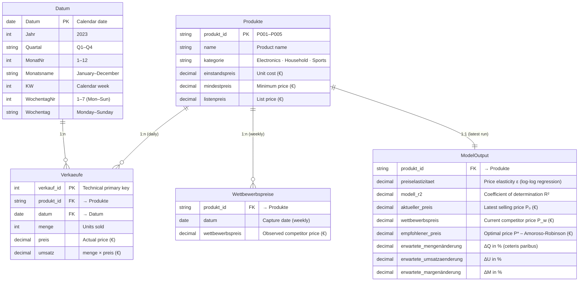

# Data Model – PricingPrototypeDB

> **Reference:** *Thesis “Dynamic Price Optimization Model in eCommerce” – Andreas Traut*  
> This document describes the semantic data model of the Power BI PBIP project  
> ([`powerbi/`](../powerbi/)) and the underlying database structure.

---

## Star Schema (Facts and Dimensions)

The model follows a **star schema** with one central fact table (`Verkaeufe`),  
a datamart table (`ModelOutput`), and three dimension tables.



---

## Layer Model

| Table | Layer | Source | Description |
|---|---|---|---|
| `Produkte` | Core / master data | Inline (M query) | 5 products, unit costs, categories (SCD II ready) |
| `Verkaeufe` | Core / fact data | CSV `data/verkaeufe.csv` | 365 days × 5 products, selling price and revenue (fact table) |
| `Wettbewerbspreise` | Core / external | CSV `data/wettbewerbspreise.csv` | Weekly competitor monitoring |
| `ModelOutput` | Datamart | Inline (ML results) | ML output: ε, R², P*, delta metrics (prescriptive analytics) |
| `Datum` | Dimension | DAX `CALENDAR` | Calendar 2023 – year, quarter, month, week, weekday |

---

## Relationships

```text
Produkte (1) ──────────── (n) Verkaeufe
              produkt_id         produkt_id

Produkte (1) ──────────── (n) Wettbewerbspreise
              produkt_id         produkt_id

Produkte (1) ──────────── (1) ModelOutput
              produkt_id         produkt_id

Datum    (1) ──────────── (n) Verkaeufe
              Datum              datum
```

All relationships are **single-direction filtered** (single cross-filter direction),
as this corresponds to the IBCS standard for BI models (no ambiguous filter paths).

---

## DAX Measures (Overview)

| Measure | Formula (simplified) | Folder |
|---|---|---|
| `Aktueller Preis Ø` | `AVERAGE(ModelOutput[aktueller_preis])` | Preise |
| `Empfohlener Preis Ø` | `AVERAGE(ModelOutput[empfohlener_preis])` | Preise |
| `Wettbewerbspreis Ø` | `AVERAGE(ModelOutput[wettbewerbspreis])` | Preise |
| `Preisänderung %` | `DIVIDE([PL] - [AC], [AC])` | Preise |
| `Preiselastizität Ø` | `AVERAGE(ModelOutput[preiselastizitaet])` | Modell |
| `Modell R² Ø` | `AVERAGE(ModelOutput[modell_r2])` | Modell |
| `Preis-Elastizitäts-Klasse` | IF cascade on `[Preiselastizität Ø]` | Modell |
| `ΔMenge % Ø` | `DIVIDE(AVERAGE([erwartete_mengenänderung]), 100)` | Erwartete Änderungen |
| `ΔUmsatz % Ø` | `DIVIDE(AVERAGE([erwartete_umsatzaenderung]), 100)` | Erwartete Änderungen |
| `ΔMarge % Ø` | `DIVIDE(AVERAGE([erwartete_margenänderung]), 100)` | Erwartete Änderungen |
| `Gesamtumsatz AC` | `SUM(Verkaeufe[umsatz])` | Umsatz |
| `Ø Tagesumsatz` | `AVERAGEX(VALUES(Verkaeufe[datum]), SUM(Verkaeufe[umsatz]))` | Umsatz |

---

## Price Recommendation Formula

The model calculates the optimal price using the **Amoroso-Robinson relation**:

$$P^* = rac{C}{1 + 1/arepsilon} \quad 	ext{(for } |arepsilon| > 1	ext{)}$$

Business rules:
- Maximum price change of **±20%** per recommendation
- **Minimum margin** of 10% on unit cost `C`
- **30% weighting** of competitor price `P_w`

---

## Visualization of the Results

| Page | Content |
|---|---|
| [Page 1 – Price Optimization Dashboard](../powerbi/screenshots/page1_preisoptimierung_dashboard.png) | KPI cards, price comparison AC/PL/competitor, delta deviations, elasticities, detail table |
| [Page 2 – Revenue & Price Development](../powerbi/screenshots/page2_umsatz_preisentwicklung.png) | Time series: daily revenue and daily prices by product |
| [Data Model Diagram](../powerbi/screenshots/datenmodell_erd.png) | ER diagram as PNG |
